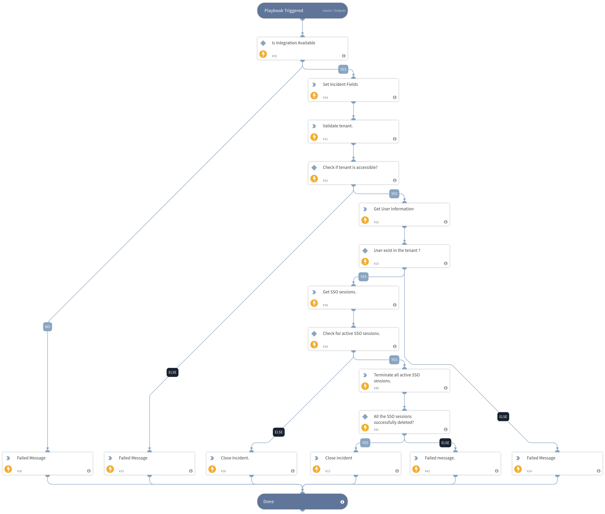

This playbook terminates user's SSO sessions so that upon the next login attempt following the unlocking of the account, authentication is required.

## Dependencies
This playbook uses the following sub-playbooks, integrations, and scripts.

### Sub-playbooks
This playbook does not use any sub-playbooks.

### Integrations
* SafeNetTrustedAccess

### Scripts
* PrintErrorEntry
* IsIntegrationAvailable

### Commands
* sta-get-user-info
* sta-validate-tenant
* sta-delete-user-sessions
* setIncident
* closeInvestigation
* sta-get-user-sessions

## Playbook Inputs
---

| **Name** | **Description** | **Default Value** | **Required** |
| --- | --- | --- | --- |
| userName | Username of the user. | ${incident.safenettrustedaccessusername} | Required |
| instanceName | Name of the SafeNet Trusted Access integration instance. | ${incident.safenettrustedaccessinstancename} | Required |

## Playbook Outputs
---
There are no outputs for this playbook.

## Playbook Image
---
